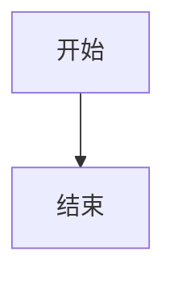
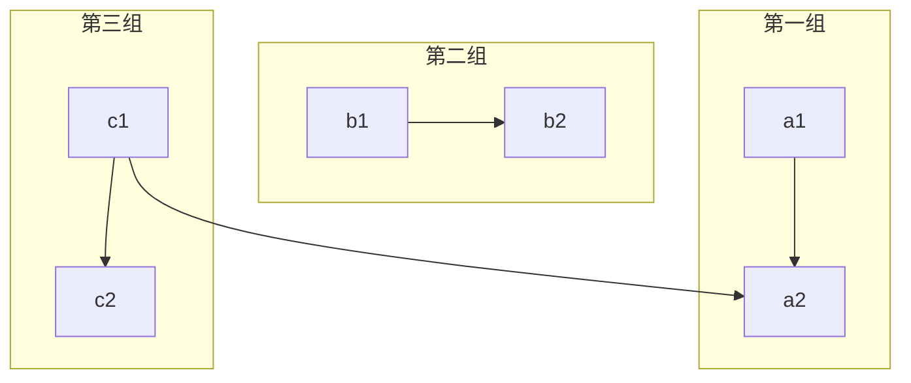
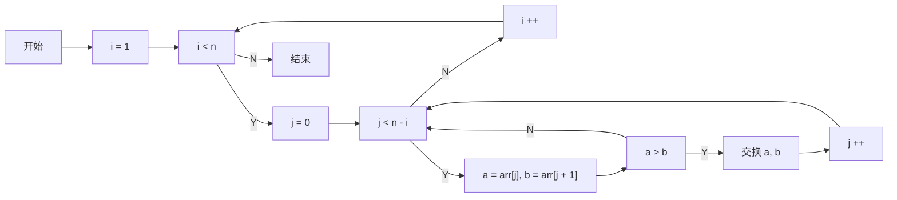

# MarkDown

HBuilderX provides powerful support for md and is an excellent markdown writing tool.

Download HBuilderX. click Help-Markdown Help. Then a md file will be opened to explain HBuilderX's enhancements to markdown.
**Try it yourself**

## Support Emmet and Shortcut
------

- **title**: `h2+Tab` to generate a secondary title
- **image**: Tap `tab` after `img`
- **link**: Tap `tab` after `a`
- **table**: Tap `tab` after `table3*3`. A table with 3 rows and 3 columns is generated. Cursor locate in the first row.
- **split line**: Tap `tab` after `hr`
- **code block**: Tap `tab` after `code`. The first line will take effect.
- **Tap `Tab` after `day`**, the current date. Note that day must have a space at the beginning or in front of the line.
- **Tap `Tab` after `time`**, the current time. Note that day must have a space at the beginning or in front of the line.
- **Bold text**: Tap `tab` after `b`
- **The text is slanted**: Tap `tab` after `i`
- **Comment out**: `Ctrl+/` to insert comment

## Powerful Smart Paste
------

- **Image**: Supports smart paste, when you paste a graphic from the clipboard to an md file, it will be automatically saved as an attachment.
- **Link**: Supports smart paste, pasting URL will automatically become a hyperlink format; pasting a local file will also automatically create a reference link.
- **Table**: Support copy and paste tables from excel, wps, word, number tables

## Powerful Double-click
------

- **Title**: Double-click the # sign will select the paragraph between two # signs
- **Ordered list**: Double-click the number in front of the numbered list to rearrange the numbers and correct the ordering error of the list
- **Code block**: double-click the beginning of the delimiter, and then entire text between delimiters will be selected
- **Comment**: double-click the beginning or the end of the comment to select the entire comment
- **Link**: double-click the beginning of the `[` sign, and then the link text and url will be selected
- **Picture**: double-click the beginning of the `!` sign, and then the picture text and url will be selected

## Powerful Format Function
------

Table: Press `Ctrl+K` to automatically format the table

## Document Outline
------

HBuilderX Markdown file also supports document outline view.

Windows shortcut key: `Alt+w`; MacOSX shortcut key: `Ctrl+w`

## Task List
------

The task list is very practical, and it is very convenient to manage to-do and already done.

- [ ] Task List-Unfinished Tasks `Windows Shortcut Key: Ctrl+Alt+[`, `Mac Shortcut Key: Ctrl+Option+[`
- [x] Task list-completed tasks `Windows Shortcut key: Ctrl+Alt+]`, `Mac Shortcut key: Ctrl+Option+]`

## 路径提示@PathHints
------

HBuilderX 3.6.8+，MarkDown支持文件路径提示，比如提示图片路径，如下图：

## Sharing to Web Link
------

When you add images to an md file, it is difficult to manage these images without online server because the md file only accepts image links.

HBuilderX provides markdown one-click sharing feature with [uniCloud](https://unicloud.dcloud.net.cn/). It is a simple, secure, stable and free cloud platform.

With the one-click sharing feature, you can upload markdown documents to uCloud in HBuilderX and return a url that can be shared. At the same time, the images involved in markdown will also be automatically uploaded to uCloud. This feature is completely free.

For more information: [MarkDown One-Key Sharing Instructions](https://ask.dcloud.net.cn/article/37573)

[markdown sharing](/Tutorial/extension/markdown_share)

<<<<<<< HEAD
## file anchor go to definition@goto-definition

HBuilderX 3.5.2，Markdown supports `` filename + anchor go to definition, and supports `@` aliases。

## Onedrive Sync
=======
## Mermaid流程图@Mermaid
------
>>>>>>> b6cd955 (update markdown.md for 3.6.8-alpha)

> HBuilderX 3.6.8+，MarkDown支持Mermaid 流程图，并支持在内置浏览器预览。

Markdown 的原生语法不支持绘制图形，但通过 Mermaid 扩展，我们可以将一些格式化的文字渲染成我们需要的图形。比如 “流程图”。

下文将介绍如何通过 Mermaid 绘制「流程图」。

流程图由几何图形节点及连接线组成。几何图形节点是流程图内的各元素的载体，通常用形状来区分其属性，例如圆形代表开始或结束、菱形代表判断等。连接线用于描述几何图形节点之间的联系，可能是有向线段，也可能是无向线段等。

在 Markdown 中添加 Mermaid 图形，需要声明 Mermaid 类型的代码块，代码如下：

### 基本语法

基本的流程图包含：流程图布局方向、几何图形和连接线三个部分组成。

**流程图布局方向**

|标志	|方向	|
|--	|--	|
|TB	|top bottom - 从上到下|
|BT	|bottom top - 从下到上|
|RL	|right left - 从右到左|
|LR	|left right - 从左到右|
|TD	|等同于 TB|

**连接线**

不同种类的连接线可以表示不同类型的关系，例如，无方向的连接线可用来表示相关性、有方向的连接线可以表示数据流向或者节点间的依赖关系；用实线表示强关联、用虚线表示弱关联等待。

### 示例1： 基本的横向流程图

### 示例2：基本的竖向流程图

### 示例3：分组图

### 示例4：冒泡排序流程图

### 示例5：连接线语法

基本的连接线语法：

带文字的连接线线语法：

## Onedrive Sync
------

### Onedrive

Firstly, recommend a cloud synchronisaion tool - microsoft onedrive https://skydrive.live.com/

After dropbox is blocked, onedrive becomes the best choice because it is free, stable, safe and cross-platform.

Onedrive is build-in in windows 10. It also can be downloaded from above link for other platforms. (It is important to install the onedriver client software, or use VPN for web version) .

Setup an onedrive account. A onedrive folder will be created in your PC. Create a folder. The folder name can be anything, for example. "notes". The md file written by HBuilderX can be saved in it.

When the md file is saved in HBuilderX, it will also be synchronized to onedrive. This file will also be synced when you log in to other devices.

onedrive app in mobile do not support open markdown. For iOS, mweb is recommended. For Android, Hammer notes is recommended.

## Sync to SVN and Git

After install node, once the file is changed, watch will commit to svn and git.

To do list for a team can be synchronised in this way.

In DCloud, we use the first method. Co-working Files is using the second method.

svn and git are more suitable for PC users to modify and view on the mobile. HBuilderX+markdown provides a better experience than Evernote and OneNote. Start quickly. Efficient editing and User-friendly for reading.

However, Onedrive is a better solution for frequent editing.

HBuilderX will provide an excellent Markdown editing experience.
