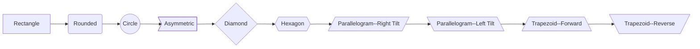
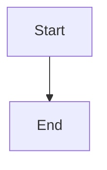
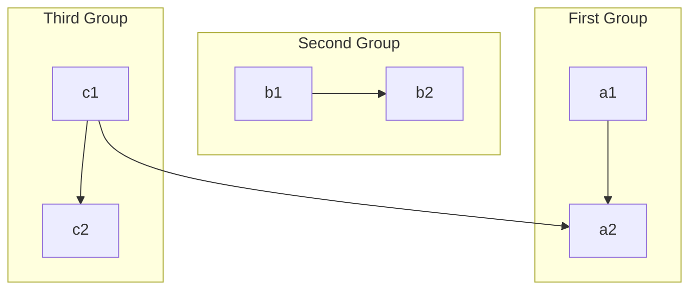
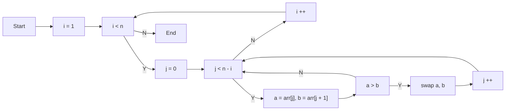
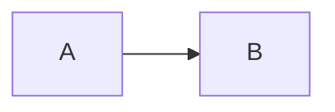
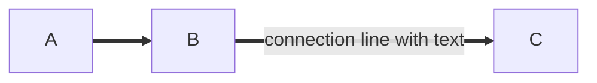
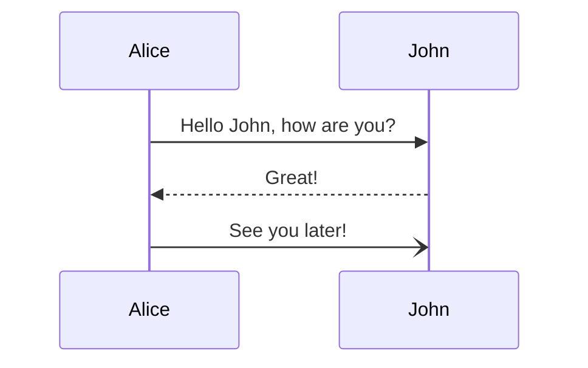

# MarkDown

HBuilderX provides powerful support for md and is an excellent markdown writing tool.

Download HBuilderX. click Help-Markdown Help. Then a md file will be opened to explain HBuilderX's enhancements to markdown.
**Try it yourself**

## Support Emmet and Shortcut
------

- **title**: `h2+Tab` to generate a secondary title
- **image**: Tap `tab` after `img`
- **link**: Tap `tab` after `a`
- **table**: Tap `tab` after `table3*3`. A table with 3 rows and 3 columns is generated. Cursor locate in the first row.
- **split line**: Tap `tab` after `hr`
- **code block**: Tap `tab` after `code`. The first line will take effect.
- **Tap `Tab` after `day`**, the current date. Note that day must have a space at the beginning or in front of the line.
- **Tap `Tab` after `time`**, the current time. Note that day must have a space at the beginning or in front of the line.
- **Bold text**: Tap `tab` after `b`
- **The text is slanted**: Tap `tab` after `i`
- **Comment out**: `Ctrl+/` to insert comment

## Powerful Smart Paste
------

- **Image**: Supports smart paste, when you paste a graphic from the clipboard to an md file, it will be automatically saved as an attachment.
- **Link**: Supports smart paste, pasting URL will automatically become a hyperlink format; pasting a local file will also automatically create a reference link.
- **Table**: Support copy and paste tables from excel, wps, word, number tables

## Powerful Double-click
------

- **Title**: Double-click the # sign will select the paragraph between two # signs
- **Ordered list**: Double-click the number in front of the numbered list to rearrange the numbers and correct the ordering error of the list
- **Code block**: double-click the beginning of the delimiter, and then entire text between delimiters will be selected
- **Comment**: double-click the beginning or the end of the comment to select the entire comment
- **Link**: double-click the beginning of the `[` sign, and then the link text and url will be selected
- **Picture**: double-click the beginning of the `!` sign, and then the picture text and url will be selected

## Powerful Format Function
------

Table: Press `Ctrl+K` to automatically format the table

## Document Outline
------

HBuilderX Markdown file also supports document outline view.

Windows shortcut key: `Alt+w`; MacOSX shortcut key: `Ctrl+w`

## Task List
------

The task list is very practical, and it is very convenient to manage to-do and already done.

- [ ] Task List-Unfinished Tasks `Windows Shortcut Key: Ctrl+Alt+[`, `Mac Shortcut Key: Ctrl+Option+[`
- [x] Task list-completed tasks `Windows Shortcut key: Ctrl+Alt+]`, `Mac Shortcut key: Ctrl+Option+]`

## Path Hints@PathHints
------

HBuilderX 3.6.8+, MarkDown supports file path hints, such as prompting image paths, as shown below:

## Sharing to Web Link
------

When you add images to an md file, it is difficult to manage these images without online server because the md file only accepts image links.

HBuilderX provides markdown one-click sharing feature with [uniCloud](https://unicloud.dcloud.net.cn/). It is a simple, secure, stable and free cloud platform.

With the one-click sharing feature, you can upload markdown documents to uCloud in HBuilderX and return a url that can be shared. At the same time, the images involved in markdown will also be automatically uploaded to uCloud. This feature is completely free.

For more information: [MarkDown One-Key Sharing Instructions](https://ask.dcloud.net.cn/article/37573)

[markdown sharing](/Tutorial/extension/markdown_share)

## file anchor go to definition@goto-definition

HBuilderX 3.5.2，Markdown supports `` filename + anchor go to definition, and supports `@` aliases。

## Mermaid Flowcharts@Mermaid
------

> HBuilderX 3.6.8+, MarkDown supports mermaid flowcharts and supports preview in the built-in browser.

Markdown's native syntax does not support drawing graphics, but with the mermaid extension, we can render some formatted text into the graphics we need, such as "flowcharts".

The following will introduce how to draw "flowcharts" with mermaid.

A flowchart consists of geometric shape nodes and connection lines. Geometric shape nodes are carriers of various elements in the flowchart. Their properties are usually distinguished by shapes, for example, circles represent start or end, diamonds represent decisions, etc. Connection lines are used to describe the relationships between geometric shape nodes, which may be directed lines or undirected lines, etc.

To add mermaid graphics in Markdown, you need to declare a code block of type mermaid, as follows:

**In HBuilderX, mermaid diagram preview effect in built-in browser:**

> **This document only introduces the basic mermaid syntax. For more mermaid syntax, please refer to [mermaid official documentation](https://mermaid-js.github.io/mermaid/#/)**

### Basic Syntax

A basic flowchart consists of three parts: flowchart layout direction, geometric shapes, and connection lines.

**Flowchart Layout Direction**

|Flag	|Direction	|
|--	|--	|
|TB	|top bottom - from top to bottom|
|BT	|bottom top - from bottom to top|
|RL	|right left - from right to left|
|LR	|left right - from left to right|
|TD	|equivalent to TB|

**Connection Lines**

Different types of connection lines can represent different types of relationships. For example, undirected connection lines can represent correlation, directed connection lines can represent data flow or dependencies between nodes; solid lines represent strong association, dashed lines represent weak association, etc. 

### Example 1: Basic Horizontal Flowchart

### Example 2: Basic Vertical Flowchart

### Example 3: Group Chart

### Example 4: Bubble Sort Flowchart

### Example 5: Connection Line Syntax

Basic connection line syntax:

Connection line with text syntax:

### Example 6: sequenceDiagram

Basic syntax is as follows:

**Note:** [View more sequenceDiagram syntax](https://mermaid-js.github.io/mermaid/#/sequenceDiagram)

## Onedrive Sync
------

Firstly, recommend a cloud synchronisaion tool - microsoft onedrive https://skydrive.live.com/

After dropbox is blocked, onedrive becomes the best choice because it is free, stable, safe and cross-platform.

Onedrive is build-in in windows 10. It also can be downloaded from above link for other platforms. (It is important to install the onedriver client software, or use VPN for web version) .

Setup an onedrive account. A onedrive folder will be created in your PC. Create a folder. The folder name can be anything, for example. "notes". The md file written by HBuilderX can be saved in it.

When the md file is saved in HBuilderX, it will also be synchronized to onedrive. This file will also be synced when you log in to other devices.

onedrive app in mobile do not support open markdown. For iOS, mweb is recommended. For Android, Hammer notes is recommended.

## Sync to SVN and Git

After install node, once the file is changed, watch will commit to svn and git.

To do list for a team can be synchronised in this way.

In DCloud, we use the first method. Co-working Files is using the second method.

svn and git are more suitable for PC users to modify and view on the mobile. HBuilderX+markdown provides a better experience than Evernote and OneNote. Start quickly. Efficient editing and User-friendly for reading.

However, Onedrive is a better solution for frequent editing.

HBuilderX will provide an excellent Markdown editing experience.
