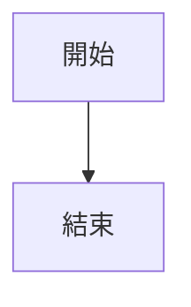
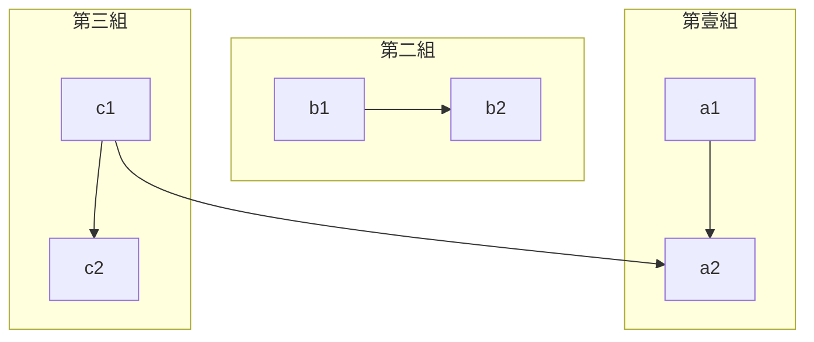
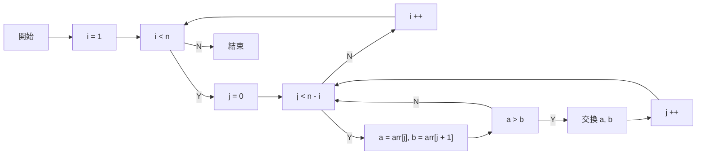
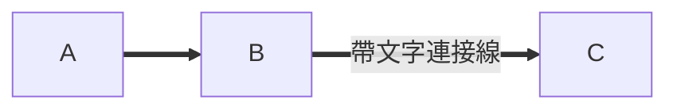

HBuilderX對md提供了強大支持，是有史以來最強大、最簡潔、最高效的markdown書寫工具。

下載HBuilderX，點菜單幫助-markdown語法說明，會打開壹個md文件，裏面詳細演示了HBuilderX對markdown的強化。
**推薦在那裏實際體驗**

## 強大的Emmet支持、及快捷鍵支持
------

- 標題:  敲`h2+Tab`即可生成二級標題
- 圖片: `img`後敲`Tab`
- 鏈接: `a`後敲`Tab`
- 表格: `table3*3`後敲`Tab`，表示生成3行3列的表格，行首生效
- 分割線: `hr`後敲`Tab`
- 代碼塊: `code`後敲`Tab`，行首生效
- `day`後敲`Tab`，當前日期。注意day需在行首或前面有空格
- `time`後敲`Tab`，當前時間。注意time需在行首或前面有空格
- 文字加粗: `b`後敲`Tab`
- 文字傾斜: `i`後敲`Tab`
- 注釋：快捷鍵`Ctrl+/`快速插入注釋

## 強大的智能粘貼
------

- 圖片: 支持智能粘貼，粘貼剪切板裏的圖形時會自動保存爲本md文檔的附件
- 鏈接: 支持智能粘貼，粘貼URL會自動變成超鏈接格式，粘貼本地文件進來也會自動創建引用鏈接
- 表格: 支持從excel、wps、word、number的表格中複制粘貼表格進來

## 強大的智能雙擊
------

- 標題: 雙擊`#號`可選中整個標題段落
- 有序列表: `雙擊`前面的數字，可重新對數字排序，修正序號錯誤
- 代碼塊: `雙擊`語法區開頭，即`!左側`，選中包含定義符的整段文字
- 注釋: `雙擊`注釋首尾的定義符，選中整段注釋
- 鏈接: `雙擊`語法區開頭，即`[`左側，選中包含定義符的整段文字
- 圖片: `雙擊`語法區開頭，即`!`左側，選中包含定義符的整段文字

## 強大的整理功能
------

- 表格：支持`Ctrl+K`可以自動整理表格格式


## 直觀的文檔結構圖
------
HBuilderX Markdown文件，也支持顯示文檔結構圖（大綱視圖）。

windows快捷鍵: `Alt+w`; MacOSX快捷鍵：`Ctrl+w`


還可以通過`Ctrl+Shift+o`的快捷大綱功能來搜索標題，當標題較多時，可以更快的找到所需的標題

## 實用的任務列表

任務列表非常實用，管理待辦、已辦非常便利。

- [ ] 任務列表-未完成任務 `快捷鍵：Ctrl+Alt+[`
- [x] 任務列表-已完成任務 `快捷鍵：Ctrl+Alt+]`

## 路徑提示@PathHints
------

HBuilderX 3.6.9+，MarkDown支持文件路徑提示，比如提示圖片路徑，如下圖：


## markdown壹鍵分享
------
使用markdown也有壹個重要的問題，那就是圖片的存儲，markdown文件要用到圖片時必須是壹個鏈接，在不使用圖床的情況下，編輯上傳圖片太麻煩。

HBuilderX 2.8.8,  推出了 MarkDown壹鍵分享功能。使用uniCloud作爲圖床 什麽是[uniCloud](https://uniapp.dcloud.io/uniCloud/README)，可靠、安全、簡單易用、免費。

markdown壹鍵分享，顧名思義是在HBuilderX中寫好的markdown文檔，可以簡單通過編輯器右鍵【壹鍵分享】菜單或者快捷鍵上傳到雲端，並生成分享鏈接，並且完全免費！

文檔引用到本地圖片會自動解析壹並上傳到雲端。

[markdown壹鍵分享](/Tutorial/extension/markdown_share)

## 跨文件跳轉到標題@goto-definition

當編輯較多markdown文檔時，有多文件互相跳轉和引用的需求。
可以通過`[詳見](a.md)`的方式來跳轉到文件`a.md`中。

除了簡單的文件跳轉，HBuilderX 3.5.2起，還支持跳轉到#標題，並且支持章節的`@`別名。

以下圖爲例，假使妳正在編輯的文檔爲`1.md`，同目錄下還有壹個md文件叫`todo.md`，其中有壹個壹級標題`# web`，那麽按下圖寫法，按下alt+鼠標左鍵就可以跳轉到`todo.md`文件的標題`web`的位置。


HBuilderX的跳轉標題策略是可以不區分多級標題的。`todo.md`有個二級標題`## web2`，則可以寫爲`[詳見](todo.md#web2)`，也可以寫爲`[詳見](todo.md##web2)`

當壹篇文章內有多個的標題名稱壹樣時，可以通過@別名的方式來區別。

比如todo.md的內容如下，有2個`web2`：
```
# web
## web2
# web2
```

如何區分這2個`web2`呢？此時可以給標題起別名
```
# web
## web2@web2a
# web2@web2b
```

那麽引用處寫成`[詳見](todo.md#web2a)`，就可以准確跳轉到二級標題web2的位置了。

## Mermaid流程圖@Mermaid
------

> HBuilderX 3.6.8+，MarkDown支持Mermaid 流程圖，並支持在內置浏覽器預覽。

Markdown 的原生語法不支持繪制圖形，但通過 Mermaid 擴展，我們可以將壹些格式化的文字渲染成我們需要的圖形。比如 “流程圖”。

下文將介紹如何通過 Mermaid 繪制「流程圖」。

流程圖由幾何圖形節點及連接線組成。幾何圖形節點是流程圖內的各元素的載體，通常用形狀來區分其屬性，例如圓形代表開始或結束、菱形代表判斷等。連接線用于描述幾何圖形節點之間的聯系，可能是有向線段，也可能是無向線段等。

在 Markdown 中添加 Mermaid 圖形，需要聲明 Mermaid 類型的代碼塊，代碼如下：


### 基本語法

基本的流程圖包含：流程圖布局方向、幾何圖形和連接線三個部分組成。

**流程圖布局方向**

|標志	|方向	|
|--	|--	|
|TB	|top bottom - 從上到下|
|BT	|bottom top - 從下到上|
|RL	|right left - 從右到左|
|LR	|left right - 從左到右|
|TD	|等同于 TB|

**連接線**

不同種類的連接線可以表示不同類型的關系，例如，無方向的連接線可用來表示相關性、有方向的連接線可以表示數據流向或者節點間的依賴關系；用實線表示強關聯、用虛線表示弱關聯等待。[](#示例3)

### 示例1： 基本的橫向流程圖


### 示例2：基本的豎向流程圖




### 示例3：分組圖




### 示例4：冒泡排序流程圖




### 示例5：連接線語法

基本的連接線語法：


帶文字的連接線線語法：




## 雲同步筆記的技巧
------

#### 雲同步工具

首先推薦壹個雲同步工具，微軟的onedrive。[https://skydrive.live.com/](https://skydrive.live.com/)

在dropbox被牆後，onedrive成爲最佳選擇，免費、穩定、安全、多平台。

win10平台自帶onedrive客戶端，其他平台可在上述網址下載安裝。（壹定要安裝客戶端，web版也需要翻牆）

配置onedrive賬戶後，在本機我的電腦上會出現壹個onedrive文件夾，在裏面新建壹個“note”的文件夾（名字可自定），然後把HBuilderX寫的md都存到這個文件夾中。

每次在HBuilderX中保存md文件後，onedrive會自動同步這個文件到雲端。

使用其他電腦或手持設備後，也會自動看到這個文檔。

onedrive手機端不支持直接查看markdown，可另行安裝手機App，iOS上推薦使用mweb，安卓上推薦使用錘子便簽。


#### svn、git同步

本機裝好node後，利用watch監聽文件變化，發現文件修改可自動提交到svn或git。

團隊共享的待辦事項同步可以用這種方式處理。

在DCloud內部，個人文檔大多采用方式1，公司協作文檔均采用方式2。並行使用。

這套方案適用于pc端編寫，手機端查看的場景。這個場景下，HBuilderX+markdown擁有遠勝于evernote、OneNote等筆記軟件的體驗。啓動更快捷、編寫更高效、閱讀更美觀。

但如果經常在手機端編寫並同步的話，還是雲筆記本軟件更合適。

總看電視和刷短視頻，會讓人變傻。

打開HBuilderX，在鍵盤上敲出凝結思緒的markdown，會讓妳變聰明。
